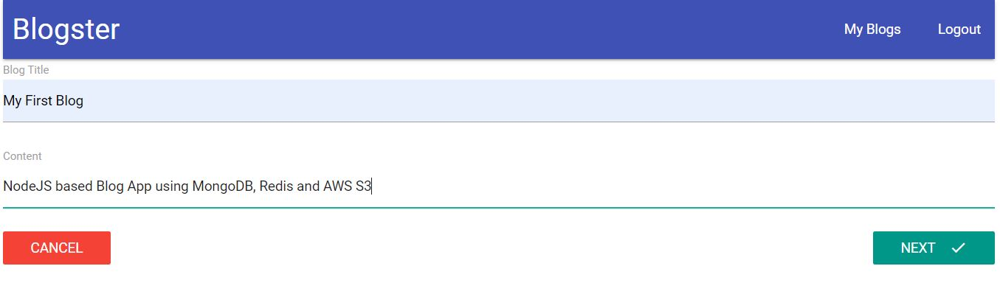
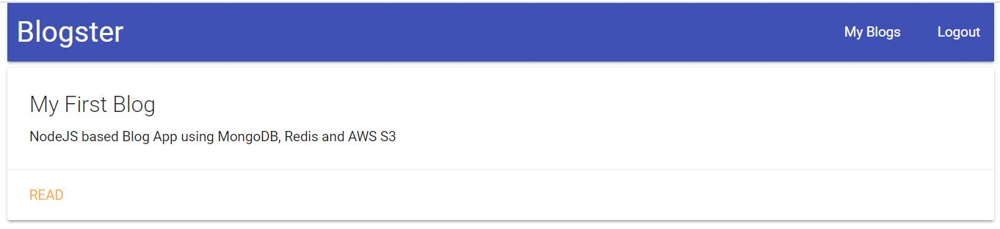

# Advanced Blog App

This project explores :

- Caching using Redis
- Scalable File upload AWS S3
- Continuous Integration (CI) using Github, Travis CI
- Automated Headless Browser Testing using Jest, Puppeteer
- OAuth

Project uses React UI and Node Express Server. Few images of project.

Create a Blog:

Review Blog and attach image:

Blogs:

